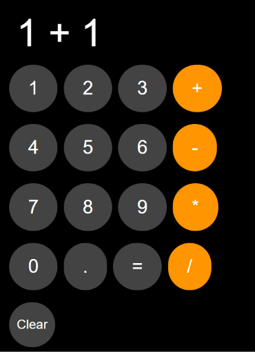

# 🧮 Calculator

A responsive web-based calculator built using **HTML, CSS, and JavaScript**. It provides a simple and interactive interface for performing basic arithmetic operations.

## 🚀 Features

* Addition, subtraction, multiplication, and division
* Decimal number calculations
* Clear and delete functionality
* Interactive buttons
* Responsive layout
* Simple and user-friendly interface

## 🛠️ Technologies Used

* **HTML5** — Page structure
* **CSS3** — Styling and responsive layout
* **JavaScript** — Calculator logic and user interactions

## 📸 Preview



## 📂 Project Structure

```text
Calculator/
├── index.html
├── style.css
├── script.js
├── screenshots/
│   └── calculator.png
└── README.md
```

## ▶️ How to Run Locally

### 1. Clone the repository

```bash
git clone https://github.com/erranagishiva/Calculator.git
```

### 2. Open the project

```bash
cd Calculator
```

### 3. Run the application

Open `index.html` in any modern web browser.

No additional dependencies or installation are required.

## 🎯 Learning Objectives

This project was built to strengthen my understanding of:

* HTML page structure
* CSS styling and layouts
* JavaScript fundamentals
* DOM manipulation
* Event handling
* Basic programming logic

## 🔮 Future Improvements

* Add keyboard support
* Add calculation history
* Add dark/light mode
* Improve accessibility
* Add scientific calculator functions

## 👨‍💻 Author

**Shiva Erranagi**

[GitHub](https://github.com/erranagishiva) · [LinkedIn](https://linkedin.com/in/erranagi-shiva-54412131a/)
